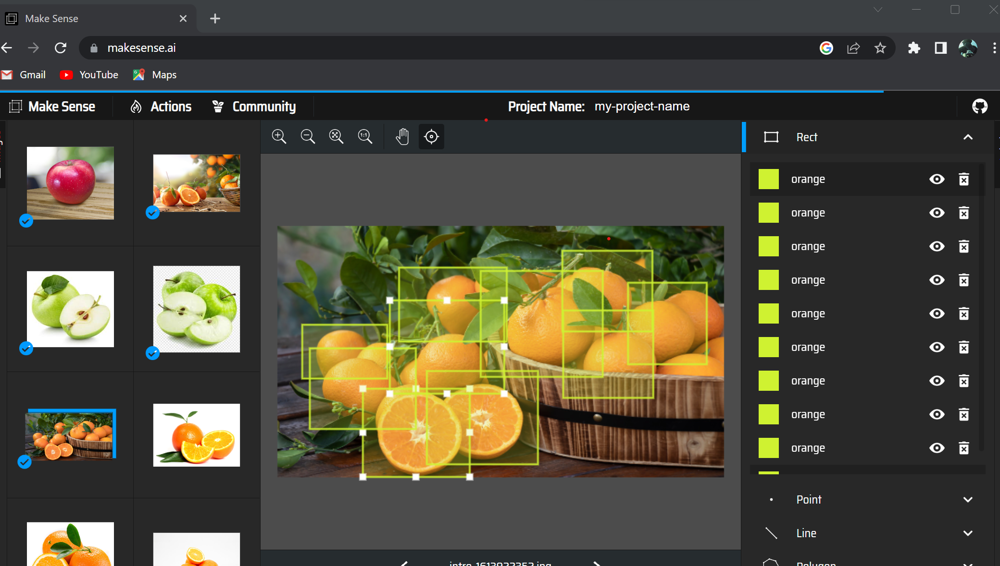
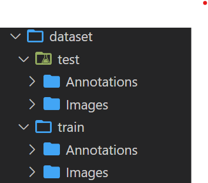

---

title: "Building Live Detection ML Model Using Tensorflow Model Maker Part One"
description: "In this blog post, we will show you how to build a live object detection machine learning model using TensorFlow Model Maker. This is the first part of a series of posts that will guide you through the process of creating and training a model using TensorFlow Model Maker. "  
keywords: 
    - AI 
    - Machine Learning
    - Data
    - AutoML
draft: false 
author: "Abdullah Al Hadrami"
showToc: true
TocOpen: false
draft: false
hidemeta: false
comments: false
showReadingTime: true
ShowReadingTime: true
ShowBreadCrumbs: true
ShowPostNavLinks: true
ShowWordCount: true
UseHugoToc: true


---
The Efficientdet lite object detection model is a lightweight, high-performing model developed by Google for deployment on devices with limited resources such as smartphones and edge devices. It is compatible with a wide range of platforms and devices including Android, Linux, Windows, Chrome OS, and iPhone, thanks to the cross-platform compatibility of the Tensorflow runtime. The model can achieve an inference speed of 20 milliseconds, making it fast for low-resource devices, and it can also be run on Intel CPUs without a GPU using the "XNNPack delegate" feature. Google provides an easy-to-use API called "Tensorflow model maker" for building and training the model, simplifying the development process. In this tutorial, we will show you how to prepare a dataset, build and train an object detection model using efficientnet lite architecture and Tensorflow Lite model maker, and use the trained model to detect apples and oranges in images. We will also provide example code and a complete running notebook for Google Colab, as well as example code for running the model on edge devices and devices with Intel CPUs but no GPU, and an Android application for live inference.
# Live Demo for Android and EDGE Device 

Here is the live demo for Object Detection App on Android and Edge Devices.


 


## Creating the dataset

 - click the below notebook link, which contain the running example of all code.

[Link to Colab Notebook](https://colab.research.google.com/github/Abdullamhd/od_efficientdet/blob/main/tflite_model_maker_github_hosted.ipynb)


- Collect the images you want to detect.

- Go to <https://www.makesense.ai/>
Choose "Get Started" and then choose the images which you already collected from your computer.

- After uploading the images, choose "Object Detection" and then "Start Labeling".

- you will see a dialog box asking you to create labels , in my case i created "apple" and "orange" labels , as shown in the image below . then select start project.


- then start labeling the images , as shown in the image below.



- After labeling all of the images, go to "Actions" and select "Export Annotations".

- Choose the VOC XML format and then download the zip file.

- Extract the zip file and you will see a folder containing the XML files for each image.

- take 20% of the images and put them in a separate folder along with the XML files for each image, this will be our test set , the rest of the images will be our training set.

- you will end up with two folders , one for the training set and one for the test set , each folder contains the image folder and the XML folder , as shown in the image below.



- Zip the dataset folder and upload them to Google Drive or github

- click the below notebook link , which contain the running example of all code.

[Link to Colab Notebook](https://colab.research.google.com/github/Abdullamhd/od_efficientdet/blob/main/tflite_model_maker_github_hosted.ipynb)

- if you are using Google Drive , from the left menu select "Files" and then "Mount Drive" , then click on the link and follow the instructions to mount your drive , then create the following folders by running the below cell in notebook is provided earlier.


!mkdir raw_data
!mkdir train_data
 

- then copy the dataset from your drive to the raw_data folder , as below code , you can find the path
of the dataset from left menu then expand the drive folder and then expand the folder you uploaded the dataset to , then right click on the dataset and select "Copy Path" , then paste it in the code below , then run the cell.


!cp /content/drive/MyDrive/tensorflow_lite_dataset/dataset_apple_orange.zip /content/raw_data
 

- if you are hosting the dataset on github , then you can skip the above step and run the below code to download the dataset from github , change the url to your dataset url.


!wget -P /content/raw_data <https://raw.githubusercontent.com/Abdullamhd/od_efficientdet/main/dataset_apple_orange.zip>
 

- then unzip the dataset to train_data folder , as shown in the below code , you can change the path of the dataset if you are using a different path.


%%capture
!unzip /content/raw_data/dataset_apple_orange.zip  -d /content/train_data
 

- Now our dataset is ready , we will choose the model from the below table , the model is postfixed with
number from zero to four , the number indicates the size of the model , the bigger the number the bigger the model size , the bigger the model size the better the accuracy , but the bigger the model size the slower the inference time , so you have to choose the model size based on your use case , i will choose the
EfficientDet-Lite0 model , which is the smallest model , the model size is 4.4 MB , the inference time is 37 ms (*Latency measured on Pixel 4 using 4 threads on CPU*)  , and the average precision is 25.69%.

| Model architecture  | Size(MB)* | Latency(ms)** | Average Precision*** |
| ------------------- | --------- | ------------- | ------------------- |
| EfficientDet-Lite0  | 4.4       | 37            | 25.69%              |
| EfficientDet-Lite1  | 5.8       | 49            | 30.55%              |
| EfficientDet-Lite2  | 7.2       | 69            | 33.97%              |
| EfficientDet-Lite3  | 11.4      | 116           | 37.70%              |
| EfficientDet-Lite4  | 19.9      | 260           | 41.96%              |

## Installing & Importing the required libraries

- let's install and import the required libraries , shown in the below code.



 %%capture

!sudo apt -y install libportaudio2
!pip install protobuf==3.19.4
!pip install -q --use-deprecated=legacy-resolver tflite-model-maker
!pip install -q pycocotools
!pip install -q opencv-python-headless==4.1.2.30
!pip uninstall -y tensorflow && pip install -q tensorflow==2.8.0

    

- Now we will import the required libraries , shown in the below code.

```python
import numpy as np
import os

from tflite_model_maker.config import QuantizationConfig
from tflite_model_maker.config import ExportFormat
from tflite_model_maker import model_spec
from tflite_model_maker import object_detector

import tensorflow as tf
assert tf.__version__.startswith('2')

tf.get_logger().setLevel('ERROR')
from absl import logging
logging.set_verbosity(logging.ERROR)
```

## Choosing the model spec

- Now we will choose the model spec , shown in the below code , you can choose any model from the table above , i will choose the EfficientDet-Lite0 model , which is the smallest model and recommended for mobile devices.

```python
spec = model_spec.get('efficientdet_lite0')
```

- Now we will load the dataset , shown in the below code.

```python
train_data  = object_detector.DataLoader.from_pascal_voc('/content/train_data/dataset/train/Images', '/content/train_data/dataset/train/Annotations', label_map={1: "apple",2:"orange"})

test_data =  object_detector.DataLoader.from_pascal_voc('/content/train_data/dataset/test/Images', '/content/train_data/dataset/test/Annotations', label_map={1: "apple",2:"orange"})

```

- Now we will train the model , shown in the below code , the default epoches is 50 , the batch size is 8 , the train_whole_model is set to True, this will train the whole model, if you set it to False , it will train only the last layer.

```python
model = object_detector.create(train_data, model_spec=spec, batch_size=8, train_whole_model=True, validation_data=test_data)

```

- once the training is done , we will export the model , shown in the below code , the model will be exported to the current directory , then you can copy it to your google drive if you are already mounted it , or you can download it from the left menu.

```python
model.export(export_dir='.')
```

- for copying the model to your google drive , run the below code


    !cp /content/model.tflite /content/drive/MyDrive/tensorflow_lite_dataset
 
## Summary

In the next post we will see how to deploy the model to android device , and linux machine , and how to use it in our applications , stay tuned.
